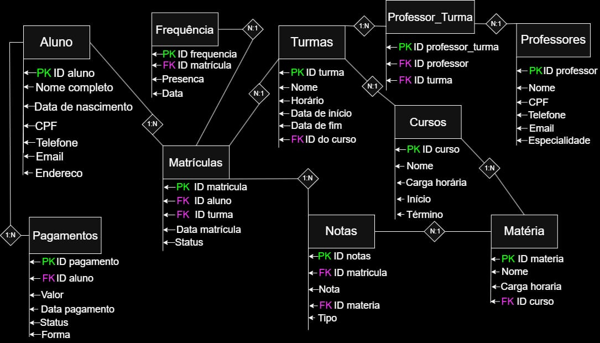

# Modelagem Conceitual

Esse documento descreve as entidades e seus relacionamentos no sistema.

## O diagrama foi desenvolvido utilizando draw.io.

Este diagrama representa a estrutura de um sistema de escola técnica, focado na visão do aluno. Partes como administrativas e outras foram abstraídas.

O foco deste diagrama é compreender como as entidades se relacionam no sistema.

## 📌 Observações:
- As PKs estão destacadas em verde.
- As FKs estão destacadas em roxo.
- A explicação foca nas entidades, atributos e relacionamentos, sem detalhar as chaves primárias.

# Explicação das entidades

 ## Aluno
### Descrição: Representa o estudante no sistema.
### Atributos:
- Nome
- CPF
- Data de nascimento
- Telefone
- Email
- Endereço

 ## Matrículas
### Descrição: Relaciona o aluno a uma turma.
### Atributos:
- (FK) ID aluno: Identificador do aluno
- (FK) ID turma: Identificador da turma
- Data da matrícula: Data que foi criada a matrícula
- Status: Indica se a matrícula está Ativa, Trancada, Em espera ou Cancelada
  ### Observações:
- A matrícula serve para vincular os alunos com as turmas. O curso não foi incluído na matrícula, pois já está vinculado à turma, evitando redundância de dados.

 ## Professores
### Descrição: Representa o professor no sistema.
### Atributos:
 - Nome
 - CPF
 - Telefone
 - Email
 - Especialidade: Área de atuação ou formação
 
  ## Cursos
### Descrição: Representa os cursos oferecidos na instituição.
Um curso pode possuir várias turmas e matérias.
### Atributos:
- Nome: Nome de cada curso
- Carga horária: Quantas horas o curso tem no total
- Início: Data de início do curso
- Término: Data de fim de curso

  ## Turmas
### Descrição: Representa uma turma vinculada a um curso, contendo informações como
horário e período das aulas.
### Atributos:
- Nome: Identificador da turma
- Horário: Período em que as aulas ocorrem
- Data de início: Data de início das aulas
- Data de fim: Data de término  das aulas
- (FK) ID do curso: Identifica qual curso a turma pertence
  
 ## Professor_Turma
### Descrição: Representa o relacionamento entre professores e turmas.
Define quais professores estão responsáveis por quais turmas.
### Atributos:
- (FK)Id_Professor: Identifica o professor
- (FK)Id_Turma: Identifica a turma
### Observações:
Resolve o relacionamento N:N entre Professor e Turma.
Um professor pode lecionar várias turmas
Uma turma pode ter mais de um professor

## Matéria
### Descrição: Representa as matérias que fazem parte de um curso.
Uma matéria pode estar presente em várias turmas e ser ensinada por diferentes professores.
### Atributos:
- Nome: Nome da matéria 
- Carga_horaria: Quantidade de horas da matéria 
- Curso_id: Identifica o curso ao qual a matéria pertence
### Observações:
Uma matéria pertence a um curso (1:N)
Uma matéria aparecer em várias turmas, evitando repetições de matérias no sistema.

## Nota
### Descrição: Representa as notas dos alunos em uma matéria dentro de uma turma.
### Atributos:
- Id_Matricula: Identifica o aluno na  
- Nota: valor da nota do aluno 
- Id_matéria: Identifica a matéria
- Tipo: Avaliação (prova, trabalho, etc.)
### Observações:
Um aluno pode ter várias notas.
Relaciona Matrícula com matéria,pemitindo controle detalhado do desempenho do aluno.

## Pagamento
## Descrição: Representa os pagamentos realizados pelo aluno referentes à sua matrícula no curso.
Permite controlar se o aluno está em dia com suas obrigações financeiras.
### Atributos:
- Id_aluno: Identifica qual aluno
- Valor: valor a ser pago
- Data_pagamento: Data em que o pagamento foi realizado
- Status: Indica a situação do pagamento (pago, pendente, atrasado)
- Forma: Forma utilizada (pix, boleto, cartão, etc.)
### Observações:
Um aluno pode ter vários pagamentos (1:N)
Relacionado diretamente com a entidade aluno, permite controle financeiro do aluno no sistema.
 
## 🚨 Em desenvolvimento
Este é um modelo inicial da modelagem conceitual.

Novas versões serão adicionadas com melhorias, correções e ajustes conforme o desenvolvimento do sistema.
